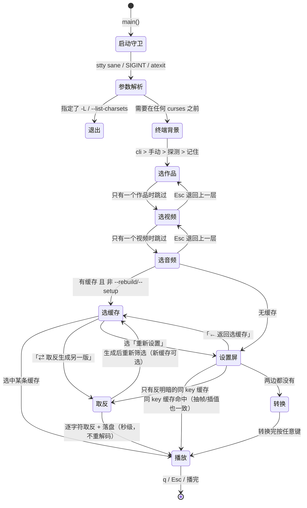
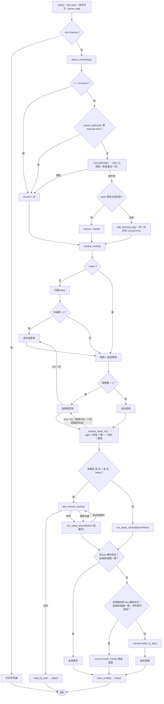
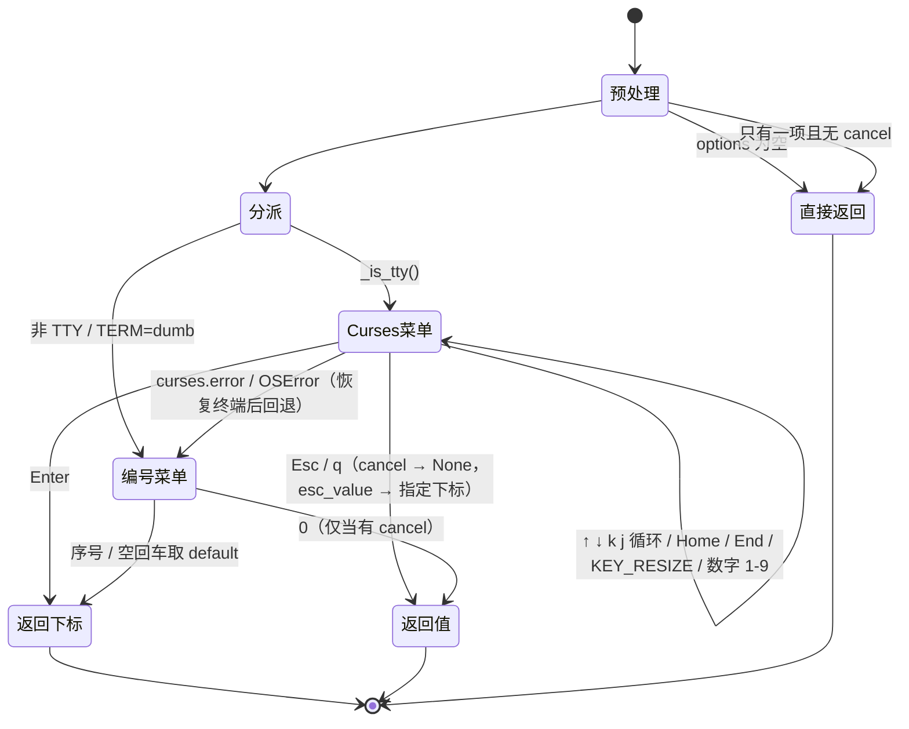
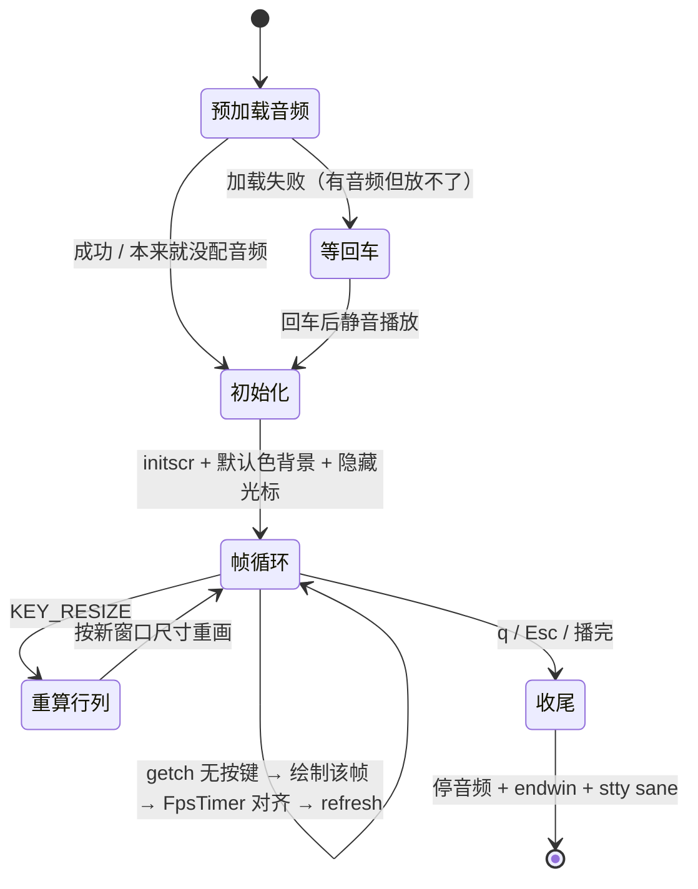

# UI 交互逻辑

这份文档描述 `Bad Apple.py` 的界面行为：状态图、常见流程、键位、以及几条容易踩的
不变量。改动界面相关代码前请先过一遍——很多设计是**踩过坑之后**才定下来的
（尤其是终端背景的探测时机和缓存 key 的边界）。

---

## 一、总览

所有选择走同一个菜单引擎 `_menu()`；TTY 下是 curses 方向键菜单，非 TTY 自动
回退成编号输入，功能完全一致。程序一共只有四种"界面"：

| 界面 | 实现 | 何时出现 |
| --- | --- | --- |
| 单选菜单 | `_menu_curses` / `_menu_plain` | 作品 / 视频 / 音频 / 缓存 / 各类子选项 |
| 一屏设置屏 | `run_setup_wizard`（复用 `_menu`） | 需要转换时 |
| 文本输入 | `ask_text` / `ask_number` / `ask_terminal_bg` | 分辨率、帧率、gamma、自定义字符表 |
| 播放画面 | `play`（裸 curses） | 缓存就绪后 |



---

## 二、主流程（含判断分支）



> 取缓存的顺序：**同 key → 反明暗同 key 取反（无损）→ 从视频转换**。
> `--rebuild` 直接跳过前两步。

> 作品菜单是**第一屏**，没有上一层，所以它没有 `Esc` 动作；视频、音频、设置屏都能逐层退回，
> 缓存菜单的 `Esc` 是「重新设置」（进入下一屏，不是返回）。逐屏对照见下面第三节的落点表。

---

## 三、菜单引擎状态机

`_menu()` 只有三个返回语义，其余交互都建立在它们之上：

| 传入 | 选中 | `Esc` / `q` | 编号回退 |
| --- | --- | --- | --- |
| `cancel=None, esc_value=None` | 返回下标 | **死键**（留在菜单里） | 无 `[0]` 项 |
| `cancel="说明"` | 返回下标 | 返回 `None` | 多一行 `[0] 说明` |
| `esc_value=i` | 返回下标 | 返回 `i`（不新增菜单项） | `esc_value` 无效，靠回车取 default |



要点：

- 菜单期间 `_terminal_dirty = True`，Ctrl+C 走信号处理器也能恢复终端。
- 选项超出屏幕时用 `top` 做滚动窗口，右下角显示 `idx+1/total`。
- 标签列按**显示宽度**对齐（CJK 算 2 列），说明文字统一贴到 `3 + 最长标签 + 3` 列。
- 只用 `curses.error / OSError` 触发回退，其余异常照常抛出（不要把 bug 吞掉）。

### Esc / q 的落点一览

原则：**Esc = 退回上一层，不改动任何设置**；只有在"没有上一层"时，才退化成该屏
的主动作；子菜单一律是"返回不改动"。高亮的落点由菜单是 `cancel` 还是
`esc_value` 决定——前者在编号模式里多出 `[0]`，后者不多占一行。

| 当前界面 | `Esc` / `q` 落点 | 编号模式 |
| --- | --- | --- |
| 选择作品（第一屏） | 无动作（没有上一层） | 无 `[0]` |
| 选择视频 | 回「选择作品」 | `[0] ← 返回选作品` |
| 选择音频 | 回真正的上一屏：有视频菜单→选视频；只弹过作品菜单→选作品；两个都没弹过→**不使用音频（静音播放）** | `[0] ← 返回…`，静音降级成普通项 |
| 选择缓存 | 「重新设置」→ 进设置屏（是进入下一屏，不是返回） | `[0] 重新设置` |
| 设置屏（从缓存菜单进来） | 返回选缓存 | `[9] ← 返回选缓存（不改动）` |
| 设置屏（首次运行 / `--setup`） | **直接开始转换**（没有上一屏可退） | 空回车 = 开始转换 |
| 设置屏里的子菜单（终端背景 / 插值） | 回设置屏，不改动 | `[0] 返回（不改动）` |
| 设置屏里的字符集菜单 | 保持当前字符集不动 | `[0] 保持当前（不改动）` |
| 设置屏里的 Braille 抖动菜单 | 整套 braille 参数（抖动 + gamma）保持不动，不再追问 gamma | `[0] 保持当前（不改动）` |
| 「探测不到终端背景」提问 | 无动作（必答一次，只问这一次） | 无 `[0]` |
| 播放中 | 退出播放 | 同左 |

> 编号（非 TTY）模式没有 `Esc`，`cancel` 变成多出来的一行 `[0]`，`esc_value`
> 则完全无效——靠**空回车取默认项**（设置屏的默认项就是「开始转换」）。

设计约束：**"静音"和"返回"不能同时占用 `Esc`**。所以音频菜单只在没有上一屏时
才把 `Esc` 当作"不使用音频"；一旦有得退，静音就降级成普通菜单项，`Esc` 让给返回。

---

## 四、播放态状态机



播放期只认 `q` / `Esc`，没有暂停、快进、进度条——这是刻意的：画面和音乐靠
`FpsTimer` 的绝对时间轴同步，任何暂停都要额外处理音频。

---

## 五、常见流程

### 1. 首次运行（该视频没有任何缓存）

```
启动 → [可能问一次终端背景] → 选作品 → 选视频 → 选音频
     → 设置屏（一屏参数，默认高亮「▸ 开始转换」）
     → 回车开始 → 逐帧转换并打印进度
     → 「按任意键开始播放…」→ 播放
```

一路回车即可（默认值就是能跑的那套）。转换完成后会**停一下等按键**，因为播放
一开始就会清屏。

### 2. 已有缓存：直接播

```
启动 → 选作品/视频/音频 → 「选择缓存 · 深色终端（自动判断，可切换）」
   [1] 180x60  braille [floyd|g1]   25 fps   ← 上次使用
   [2] 90x30   classic              30 fps
   [3] ⇄ 切换为浅色终端   按另一种背景重新筛选缓存
   [0] 重新设置
```

默认高亮在「上次使用」那条，回车即播。选 `[0]`（或 Esc）进设置屏；设置屏里
再按 Esc（或选最末一行 `← 返回选缓存`）就退回这个菜单，来回都不会改动设置。

### 3. 明暗反了（整屏像负片）

缓存菜单里选 `⇄ 切换为浅色/深色终端`。切换会写进全局偏好并**标记 manual**，
之后自动探测再也覆盖不了它。也可以进设置屏改「终端背景」那一行（可选
`自动探测` / `深色终端` / `浅色终端`）。

当前背景一条缓存都没有时，菜单里**只剩**切换项（默认高亮在它上面），
不会把人逼进设置屏重新转换。

### 4. 探测不到终端背景

在任何菜单出现之前，程序用 `COLORFGBG`（兜底）和 OSC 11 查询判断；都拿不到
就问一次：

```
  探测不到终端背景，请选一个（只问这一次，之后可随时改）
▸ 深色终端   黑底浅字，亮像素上墨
  浅色终端   白底深字，亮像素留白
```

选择写进 `cache/_prefs.json`（`manual: true`）。想交还自动探测：设置屏里选
`自动探测`，或 `rm -f cache/_prefs.json`。

> 探测必须在**任何 curses 菜单之前**做：菜单会切备用屏并改 termios，之后再问
> 终端往往收不到应答，表现为"终端背景永远不变"。

### 5. 改分辨率 / 字符集 / braille 参数

设置屏里移到对应行回车：

- **分辨率**：手输 `宽x高`，回车保持不变。
- **字符集**：进二级菜单（预设 / braille / 自定义字符表）。选 braille 会接着
  问抖动方式和 gamma，**gamma 的默认值就是当前值**，反复进来改不会丢。
  `Esc`/`q` = 保持当前不动；编号模式下是 `[0]`。
- 参数一致的同名缓存会被直接复用；参数不同（含字符集哈希）则是另一个缓存文件。

### 6. 只改了抽帧步长 / 插值方式

这两项**不在缓存文件名里**（否则现有缓存全作废），所以程序会读出缓存 payload
核对：一致就复用，不一致就打印原因并**重新转换**，覆盖同名缓存文件。

也就是说：同一个 `{宽}x{高}_{明暗}_{字符集}` 只能存一个变体，后转换的覆盖先前的。
改了抽帧/插值后第一次播放会慢一点，这是正常的。

### 7. 非 TTY（管道、重定向、IDE 里跑）

菜单自动变成编号列表：

```
选择缓存  ·  深色终端（探测不到，可切换）
  [1] 180x60  braille [floyd|g1]   25 fps   ← 上次使用
  [2] ⇄ 切换为浅色终端
  [0] 重新设置
序号 (0-2，回车默认 1):
```

空回车 = 默认项；`cancel` 项显示为 `[0]`；`footer` 提示语不打印（编号菜单不需要）。
功能与方向键菜单**完全一致**。

### 8. 中途退出 / 终端残留

| 操作 | 结果 |
| --- | --- |
| 播放中 `q` / `Esc` | 正常收尾：停音频、`endwin`、`stty sane` |
| 菜单里 `Ctrl+C` | 信号处理器恢复终端后按默认行为重发信号，进程退出 |
| `kill -9` | 钩子跑不到；在终端执行 `reset` 或 `stty sane` |
| 启动时 | 先 `stty sane` 清掉上一次可能残留的坏状态 |

### 9. 音频加载失败

进入 curses **之前**先试着加载；失败会打印原因（格式不支持、路径不对）并**等一次
回车**，然后静音播放。这个停顿和 `-d/--delay` 无关：否则 `-d 0` 时提示会被
随后的一屏画面直接刷掉。视频本来就没配音频则不会停顿。

### 10. 选错了想退回去

逐层退：

```
选音频 --Esc--> 选视频 --Esc--> 选作品 --Esc--> （第一屏，无动作）
选缓存 --Esc--> 设置屏 --Esc--> 选缓存        （来回切换，都不改动设置）
设置屏 → 字符集/抖动/插值/终端背景 --Esc--> 设置屏（该子项保持不动）
```

如果某一层因为"只有一个候选"压根没弹菜单（例如作品里只有一个视频），
那这一层就不存在，Esc 直接退回它上面的那一屏；一层菜单都没弹过时，
音频菜单的 Esc 仍然是「不使用音频（静音播放）」。

### 11. 只有反明暗的缓存（一键取反生成，不重解码）

场景：视频只有 `*_dark_*.pkl`，而你（或探测结果）是浅色终端。缓存菜单里会直接
给出「取反生成」项，默认就高亮在它上面：

```
选择缓存 · 浅色终端 · 无浅色终端缓存
  [1] ⇄ 用深色缓存取反生成浅色版   把 1 个深色缓存翻过来，秒级，不重新解码视频
  [2] ⇄ 切换为深色终端             切换到深色终端后可用 1 个缓存
  [0] 重新设置
```

- `[1]` = **我的终端确实是浅色**，把对面那些缓存逐字符翻过来（生成后重新扫描，
  新缓存立刻可选）。
- `[2]` = **刚才的判断反了**，改的是"终端背景"这个假设；终端实际是浅色却切到
  深色，就会看到负片。两者别混。

结果与"用浅色重新渲染一遍"**逐字符一致**，耗时 1~2 秒（166 MB / 5306 帧的
Braille 缓存实测 1.9 秒，同样内容重新 floyd 渲染要 30 秒以上），结果写到浅色
key 下，下次直接命中。不进缓存菜单也行：设置屏直接回车同样会走取反。

不吃捷径的两种情况：`--rebuild`（就是要重渲染）、`--chars` 自定义字符表里有
重复字符（字符↔档位不唯一，取反只能靠猜；此时那一项会消失）。

### 12. 分辨率默认值（按原片比例，治"宽版普京"）

终端字符格约 1:2，所以不变形的行列关系是
`rows = cols × 原片高 ÷ 原片宽 ÷ 2`；终端装不下时整体等比缩小（竖屏视频不会
被裁掉一截）。这一换算只在"高度没有被明确指定"时生效：

| 情况 | 分辨率初值 |
| --- | --- |
| 首次运行、`-W 90`（没给 `-H`） | 按比例算，如 4:3 → 90×34、16:9 → 90×25 |
| 终端不够大 | 先收窄列宽，再等比缩到装得下（如 61×23） |
| `-H` 明确给了 | 原样使用 |
| 上次在设置屏手填过（`height_auto: false`） | 原样沿用，不再自动换算 |
| 原片尺寸读不出来 | 退回老默认 `宽 × 30` |

设置屏里手填一次「分辨率」就会把 `height_auto` 置 false，从此尊重你的值；
老 `config.json` 没有这个字段，按"自动"处理，所以历史缓存旁边会多出一份正确
比例的新尺寸（老缓存仍在菜单里可选）。

---

## 六、键位速查

| 键 | 菜单 | 设置屏 | 播放中 |
| --- | --- | --- | --- |
| `↑` `↓` / `k` `j` | 移动（首尾循环） | 移动 | — |
| `Home` / `End` | 首项 / 末项 | 首项 / 末项 | — |
| `1`–`9` | 直选第 n 项 | 直选第 n 项 | — |
| `Enter` | 确认 | 修改该行 / 在「开始转换」上即开始 | — |
| `Esc` / `q` | 能退就退回上一层，否则忽略 | 从缓存菜单进来→返回选缓存；否则直接开始转换 | 退出播放 |
| 窗口缩放 | 重绘并保持选中 | 重绘 | 按新尺寸重排画面 |

`Esc` 的逐屏落点见 [第三节的落点表](#esc--q-的落点一览)。

编号回退模式下没有 `Esc`/`q`：`cancel` 表现为 `[0]`，设置屏靠空回车开始。

---

## 七、优先级与持久化

```
命令行  >  已有缓存配置(config.json)  >  交互询问  >  默认值
```

- **终端背景**存全局 `cache/_prefs.json`（`invert` + `manual`），因为它是**环境**
  属性而不是视频属性；按视频存会导致某次存错后自我强化。
- **其余参数**存每个视频的 `cache/<作品>__<视频>/config.json`，含
  `width/height/height_auto/fps/fps_override/charset/chars/frame_step/interp/threads/audio/invert`。
  - `height_auto` 记录"高度是按原片比例算的（true）还是用户手填的（false）"，
    缺省当作 true，这样老配置里那个不对比例的 90×30 能自动修回来。
  - `fps` 是**实际生效**的帧率（可能已被抽帧除过）；用户当时选的是"视频自带"还是
    某个数字，另记在 `fps_override` 里，设置屏按它回显。
- 设置屏里每一项的初值都走同一套优先级；`--chars` > `--braille` / `--charset`。
- 取缓存的顺序：**同 key 缓存 → 反明暗同 key 缓存取反 → 从视频转换**；
  `--rebuild` 跳过前两步。

---

## 八、不变量（改代码前请确认没破坏）

1. `detect_invert()` 必须在第一个 curses 菜单之前调用。
2. 缓存 key 只编码 宽高 / 明暗 / 字符集；抽帧与插值靠 `_payload_mismatch()` 核对 payload。
3. **`invert` 必须是渲染的最后一个整体取反步骤**（ASCII 的 `idx = n-1-idx`、
   Braille 的 `bits = 1-bits`）。"复用反明暗缓存"就靠这条等价性成立；一旦把取反
   挪到抖动/gamma 之前，或改成别的形式，`convert.invert_frames()` 就不再等价，
   必须同步改掉。
4. `_menu()` 的三个返回语义不要混用：想"取消"用 `cancel`，想"Esc = 确认"用
   `esc_value`；`esc_value` 在编号模式下无效。
5. 空白格必须用终端默认背景绘制（`_init_colors()`），否则 bce 终端的 IDE 控制台
   会出现横贯画面的白条。
6. 进 curses 前把要打印的提示都打印完（音频失败、转换完成等），之后只能靠
   `wait_any_key` / `input` 停下来让用户看。`wait_any_key` 必须对非 TTY 容错
   （管道下 `termios.tcgetattr` 会抛错，已退化成 `input()`）。
7. **每一屏都要能原路退回去**（除了第一天就存在的作品菜单）：新增一屏时，
   给它一个"上一屏"名，并让 `Esc` 落在返回项上；返回项用 `cancel`（编号模式多
   一行 `[0]`）还是 `esc_value`（不多占行、但编号模式无效）要按屏取舍。
8. 一个键不能有两种含义：`Esc` 已经是"返回"时，同一屏的"跳过/静音/取消"必须
   降级成普通菜单项（音频菜单就是这么做的）。
9. 高亮项自带 ` ▸ ` 前缀，菜单标签里**不要再写 `▸`**，否则会渲染成 ` ▸ ▸ `。
10. 分辨率的"自动"只改**高度**（以及装不下时等比缩小），且只在用户没明确指定
    高度时生效；判定依据是 `height_auto`，别把它丢了，否则要么用户手填的尺寸
    被冲掉，要么老配置永远修不回正确比例。
